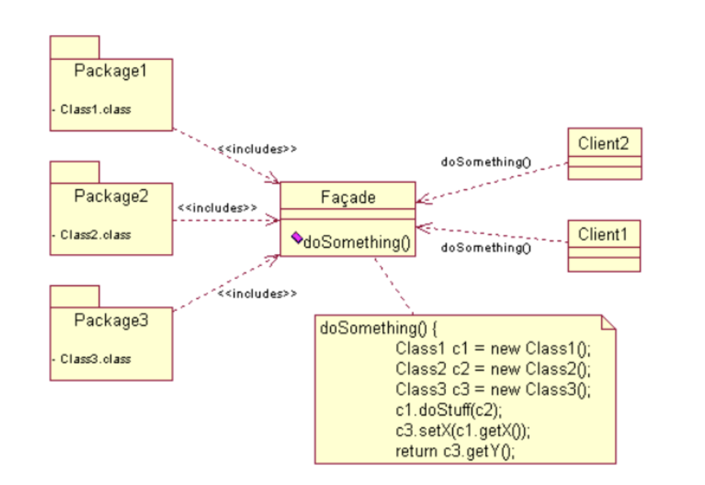

#Mixin Pattern

> Developers often use the facade design pattern when a system is very complex or difficult to understand because the system has many interdependent classes or because its source code is unavailable. This pattern hides the complexities of the larger system and provides a simpler interface to the client. It typically involves a single wrapper class that contains a set of members required by the client.


*Facade pattern*
<br/>

```javaScript
//Facading hides complexities from the user.
var mouse = (function() {
  var privates = {
    getActivity: function(act) {
      var activity = act.toLowerCase();
      if(activity === 'click') {
        return "User is clicking";
      } else if (activity === 'hover') {
        return "User is hovering";
      } else if (activity === 'rightclick') {
        return "User right clicked";
      } else if (activity === 'scroll') {
        return "User scrolled"
      } else {
        return "Unrecognised activity";
      }
    }
  }

  return {
    facade: function(activity) {
      return privates.getActivity(activity);
    }
  }
})();

console.log(mouse.facade('hover')); //User is hovering
```

##### Reference
[7 JavaScript Design Patterns Every Developer Should Know](https://javascript.plainenglish.io/7-javascript-design-patterns-every-developer-should-know-df9c40e7debf)